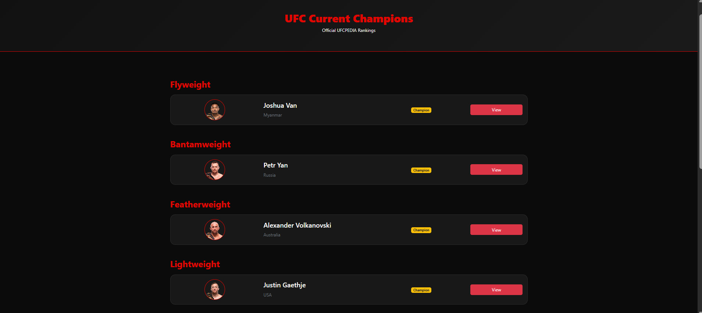

#  UFCPEDIA

A full-stack Java web application that serves as a comprehensive UFC encyclopedia, providing dynamic information about UFC fighters, events, and the latest news. The application is built using Spring Boot and MySQL, following the MVC architecture, and is deployed on Railway for public access.

---

##  Live Demo

🔗 https://ufcpedia.up.railway.app

---

## 📸 Application Preview

| Home | Fighters |
|------|-----------|
|  |  |

| Events | News |
|---------|------|
|  |  |

| Rankings | Hall of Fame |
|-----------|--------------|
|  |  |

---

#  Features

- Browse UFC Fighters
- View UFC Events
- Read Latest UFC News
- Dynamic content from MySQL Database
- Clean and responsive user interface
- MVC Architecture
- Cloud Deployment on Railway
- Database integration using Spring Data JPA (Hibernate)

---

#  Tech Stack

## Backend
- Java 21
- Spring Boot
- Spring MVC
- Spring Data JPA
- Hibernate

## Frontend
- HTML5
- CSS3
- Bootstrap
- Thymeleaf

## Database
- MySQL

## Build Tool
- Maven

## Deployment
- Railway

## Version Control
- Git
- GitHub

---

#  Project Structure

```
UFCPedia
│
├── src
│   ├── main
│   │   ├── java
│   │   │   └── com.ufcpedia
│   │   │       ├── controller
│   │   │       ├── service
│   │   │       ├── repository
│   │   │       ├── model
│   │   │       └── UfcpediaApplication.java
│   │   │
│   │   └── resources
│   │       ├── templates
│   │       ├── static
│   │       └── application.properties
│
├── pom.xml
└── README.md
```

---

#  Installation

## Clone Repository

```bash
git clone https://github.com/yourusername/ufcpedia.git
```

Move into the project

```bash
cd ufcpedia
```

---

## Configure Database

Create a MySQL database.

```sql
CREATE DATABASE railway;
```

Update the database configuration inside

```
src/main/resources/application.properties
```

Example:

```properties
spring.datasource.url=jdbc:mysql://localhost:3306/railway
spring.datasource.username=root
spring.datasource.password=your_password

spring.jpa.hibernate.ddl-auto=update
spring.jpa.show-sql=true
```

---

## Run the Project

Using Maven

```bash
mvn spring-boot:run
```

or run

```
UfcpediaApplication.java
```

from your IDE.

---

#  Database

The project uses three tables.

- fighters
- events
- news

The application retrieves all records dynamically using Spring Data JPA repositories.

---

#  Deployment

The application is deployed using **Railway**.

Deployment includes:

- Spring Boot Application
- MySQL Database
- Environment Variables
- Automatic CI/CD from GitHub

---

#  Challenges Faced

During development, several real-world deployment challenges were solved, including:

- Configuring Spring Boot for production deployment
- MySQL authentication issues
- Database migration
- Cloud database connectivity
- Hibernate configuration
- Debugging deployment failures

These challenges provided valuable experience in deploying production-ready Java applications.

---

#  Future Improvements

- Chatbot
- User Authentication
- Fighter Statistics Dashboard
- REST API
- Pagination
- Dark Mode
- Favorites Feature

---

#  What I Learned

This project helped strengthen my understanding of:

- Spring Boot
- MVC Architecture
- Spring Data JPA
- Hibernate
- MySQL
- Railway Deployment
- Git & GitHub
- Database Design
- Cloud Deployment
- Debugging Production Issues

---

#  Contributing

Contributions are welcome.

If you'd like to improve this project:

1. Fork the repository
2. Create a new branch
3. Commit your changes
4. Push to your branch
5. Open a Pull Request

---

#  Author

**Md Zafar Equbal**

Backend Java Developer

GitHub:
https://github.com/zafar-equbal

LinkedIn:
https://www.linkedin.com/in/md-zafar-equbal-33b115322/

---

#  Support

If you found this project useful, please consider giving it a Star on GitHub.

It motivates me to continue building and sharing more projects.

---

##  License

This project is licensed under the MIT License.
